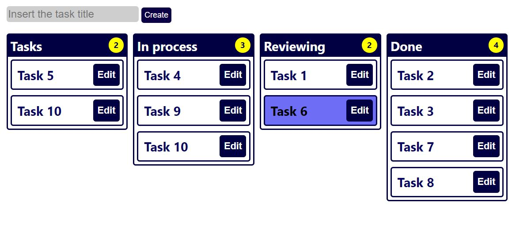

# Kanban board.

## This is an Kanban board, where you can create the taks and move throw the board by changing the status. Try your best not to keep many tasks in the "In process" column.

### In this project I used React JS with hooks:
- `useState()`
- `useEffect()`

## The [Demo Live](#) version is not available

## Project status: on going

### Built with

- React JS
- Firebase
- Netlify

### Run project on local machine

- copy and run this command to your terminal `git clone https://github.com/elmar8287/kanban-board-react-firebase.git`
- switch to right directory by `cd kanban-board-react-firebase`
- instal npm by running this command `npm i`
- start the project by running this command `npm start`

## Author

- GitHub: [@elmar8287](https://github.com/elmar8287)
- LinkedIn: [Elmar Abdulkarimov](https://www.linkedin.com/in/elmar.abdulkarimov/)

## 🤝 Contributing

Contributions, issues, and feature requests are welcome!

Feel free to check the [issues page](https://github.com/elmar8287/kanban-board-react-firebase/issues).

## Show your support

Give a ⭐️ if you like this project!

License could be find [here](https://github.com/elmar8287/kanban-board-react-firebase/blob/dev/LICENSE)
